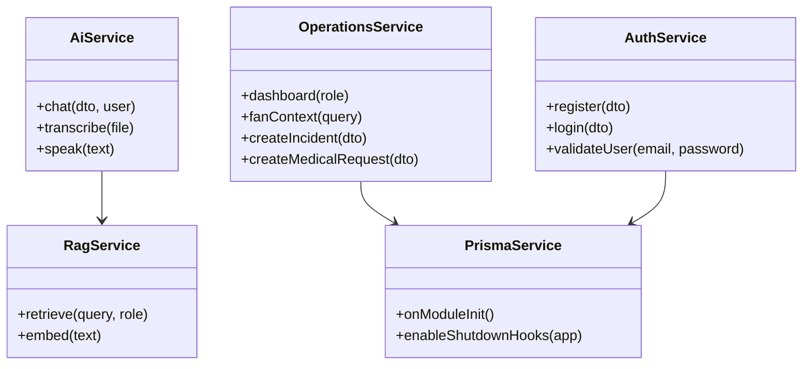

# Class Diagram

```mermaid
classDiagram
  class AiService {
    +chat(dto, user)
    +transcribe(file)
    +speak(text)
  }
  class RagService {
    +retrieve(query, role)
    +embed(text)
  }
  class OperationsService {
    +dashboard(role)
    +fanContext(query)
    +createIncident(dto)
    +createMedicalRequest(dto)
  }
  class AuthService {
    +register(dto)
    +login(dto)
    +validateUser(email, password)
  }
  class PrismaService {
    +onModuleInit()
    +enableShutdownHooks(app)
  }
  AiService --> RagService
  OperationsService --> PrismaService
  AuthService --> PrismaService
```

