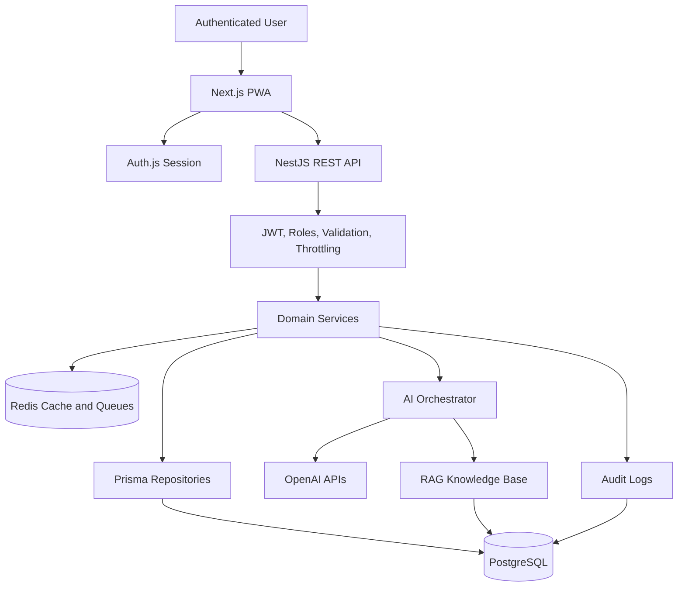

# Data Flow Diagram

```mermaid
flowchart TD
  User[Authenticated User] --> Frontend[Next.js PWA]
  Frontend --> Auth[Auth.js Session]
  Frontend --> Api[NestJS REST API]
  Api --> Guards[JWT, Roles, Validation, Throttling]
  Guards --> Services[Domain Services]
  Services --> Prisma[Prisma Repositories]
  Prisma --> Postgres[(PostgreSQL)]
  Services --> Redis[(Redis Cache and Queues)]
  Services --> Ai[AI Orchestrator]
  Ai --> OpenAI[OpenAI APIs]
  Ai --> Rag[RAG Knowledge Base]
  Rag --> Postgres
  Services --> Audit[Audit Logs]
  Audit --> Postgres
```

