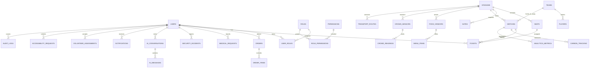

# ER Diagram

```mermaid
erDiagram
  USERS ||--o{ USER_ROLES : has
  ROLES ||--o{ USER_ROLES : assigned
  ROLES ||--o{ ROLE_PERMISSIONS : grants
  PERMISSIONS ||--o{ ROLE_PERMISSIONS : included
  STADIUMS ||--o{ SEATS : contains
  STADIUMS ||--o{ GATES : exposes
  STADIUMS ||--o{ MATCHES : hosts
  TEAMS ||--o{ PLAYERS : rosters
  TEAMS ||--o{ MATCHES : home_or_away
  USERS ||--o{ TICKETS : owns
  MATCHES ||--o{ TICKETS : admits
  SEATS ||--o{ TICKETS : assigned
  STADIUMS ||--o{ FOOD_VENDORS : serves
  FOOD_VENDORS ||--o{ MENU_ITEMS : offers
  USERS ||--o{ ORDERS : places
  ORDERS ||--o{ ORDER_ITEMS : includes
  USERS ||--o{ MEDICAL_REQUESTS : reports
  USERS ||--o{ SECURITY_INCIDENTS : reports
  STADIUMS ||--o{ CROWD_SENSORS : monitors
  CROWD_SENSORS ||--o{ CROWD_READINGS : emits
  USERS ||--o{ AI_CONVERSATIONS : starts
  AI_CONVERSATIONS ||--o{ AI_MESSAGES : contains
  USERS ||--o{ NOTIFICATIONS : receives
  USERS ||--o{ VOLUNTEER_ASSIGNMENTS : accepts
  STADIUMS ||--o{ TRANSPORT_ROUTES : connects
  USERS ||--o{ ACCESSIBILITY_REQUESTS : submits
  MATCHES ||--o{ CARBON_TRACKING : measures
  MATCHES ||--o{ ANALYTICS_METRICS : aggregates
  USERS ||--o{ AUDIT_LOGS : causes
```

