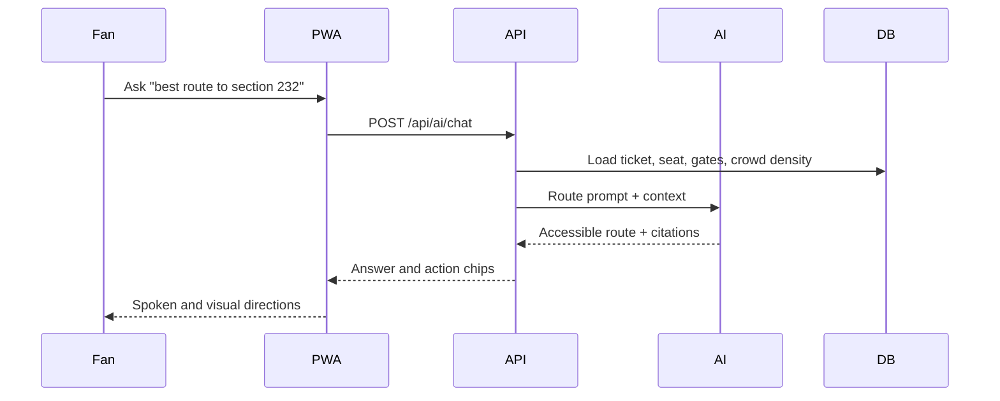
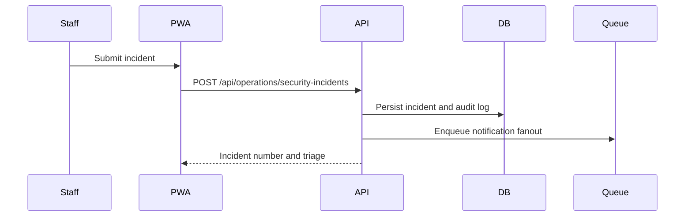

# Sequence Diagrams

## Fan Route Assistant

```mermaid
sequenceDiagram
  participant Fan
  participant PWA
  participant API
  participant AI
  participant DB
  Fan->>PWA: Ask "best route to section 232"
  PWA->>API: POST /api/ai/chat
  API->>DB: Load ticket, seat, gates, crowd density
  API->>AI: Route prompt + context
  AI-->>API: Accessible route + citations
  API-->>PWA: Answer and action chips
  PWA-->>Fan: Spoken and visual directions
```

## Security Incident

```mermaid
sequenceDiagram
  participant Staff
  participant PWA
  participant API
  participant DB
  participant Queue
  Staff->>PWA: Submit incident
  PWA->>API: POST /api/operations/security-incidents
  API->>DB: Persist incident and audit log
  API->>Queue: Enqueue notification fanout
  API-->>PWA: Incident number and triage
```

