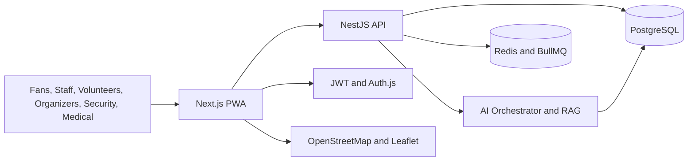

# Architecture

StadiumGPT AI is a role-aware operational platform with a Next.js PWA frontend and a NestJS API backend. PostgreSQL stores operational records, Redis powers queues and caching, and OpenAI-backed services provide multilingual decision support.

## Layers

## Key Decisions

- The frontend is a PWA so volunteers and fans can keep critical routes and guidance during intermittent connectivity.
- The backend centralizes authorization, audit logging, and operational data integrity.
- AI modules share a RAG service but use role-specific system prompts and emergency escalation rules.
- Prisma provides type-safe data access and migration discipline.
- Redis supports queue prediction refresh jobs, notification fanout, and cacheable operational summaries.

## AI Safety

Emergency and medical guidance is decision support. The product always recommends contacting on-site emergency command for life-safety decisions and preserves audit logs for incident review.

